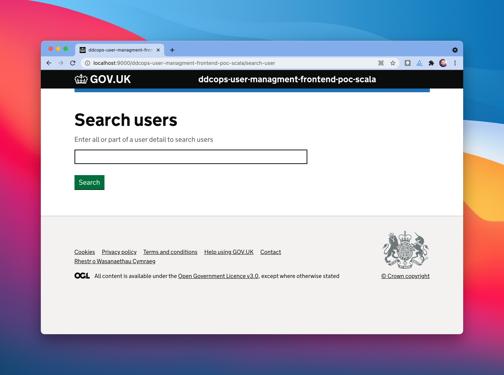
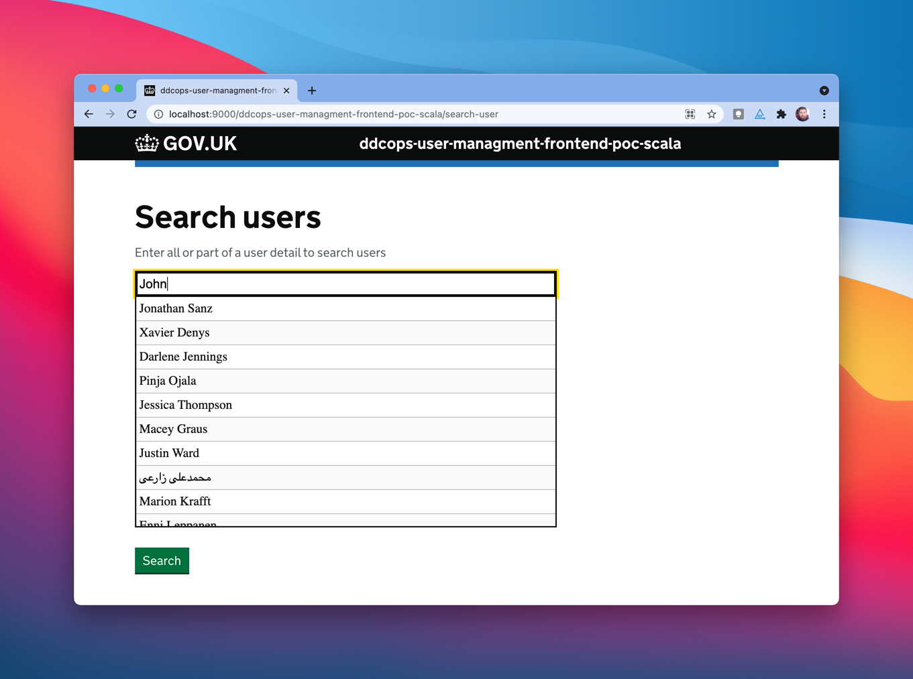
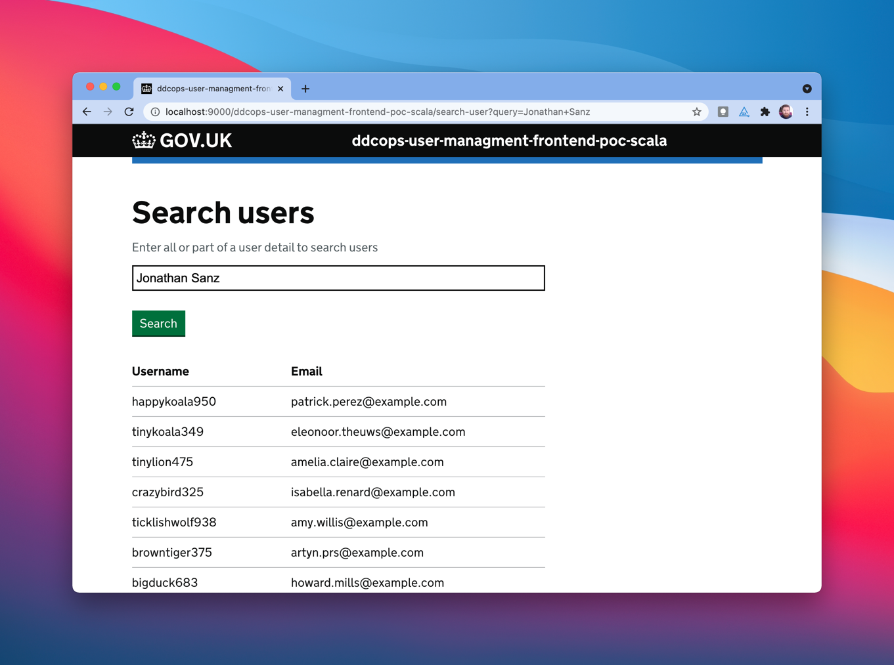

# ddcops-user-managment-frontend-poc-scala

[](https://confluence.tools.tax.service.gov.uk/display/Tools) **owned with pride by DDCOps**

This is a proof of concept to show the structure of a server side rendered play application for comparison with other
examples in react and python.

## Screenshots

1. start on landing page
   
2. begin typing and get an autocomplete box of names (note that API gives us random values not matching values)
   
3. select the auto complete entry and press search
   

## Run locally

### with sbt

```
$ sbt run
[...some content omitted...]

--- (Running the application, auto-reloading is enabled) ---

[info] p.c.s.AkkaHttpServer - Listening for HTTP on /0:0:0:0:0:0:0:0:9000

(Server started, use Enter to stop and go back to the console...)
```

And then you can view the landing page by opening http://localhost:9000/ddcops-user-managment-frontend-poc-scala/search-user

### with docker

This is an example of using the bundled docker packaging plugin.

```
$ sbt docker:publishLocal
$ docker images
REPOSITORY                                 TAG                              IMAGE ID       CREATED          SIZE
ddcops-user-managment-frontend-poc-scala   0.1.0-SNAPSHOT                   27799cc0f1e9   4 minutes ago    604MB
$ docker run -P --rm ddcops-user-managment-frontend-poc-scala:0.1.0-SNAPSHOT
$ docker ps
CONTAINER ID   IMAGE                                                     COMMAND                  CREATED         STATUS        PORTS                     NAMES
ffdb2d3860d8   ddcops-user-managment-frontend-poc-scala:0.1.0-SNAPSHOT   "/opt/docker/bin/ddc…"   3 seconds ago   Up 1 second   0.0.0.0:55001->9000/tcp   ecstatic_borg
```

And then if you take the random assigned port and open it in your browser you'll see the service running locally. For
example with the above that's port `:55001` so I can then
visit http://localhost:55001/ddcops-user-managment-frontend-poc-scala/search-user to view the landing page.

### License

This code is open source software licensed under the [Apache 2.0 License]("http://www.apache.org/licenses/LICENSE-2.0.html").
